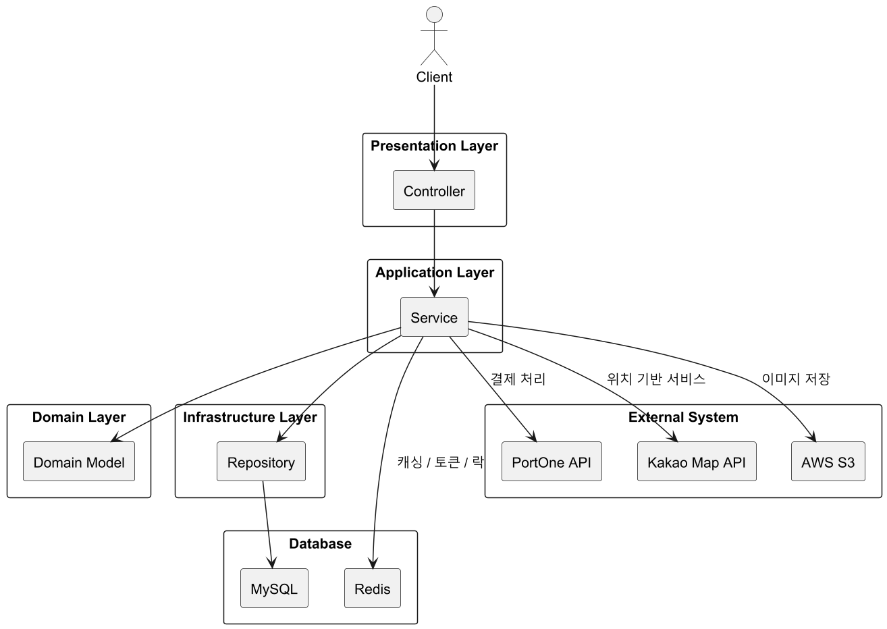
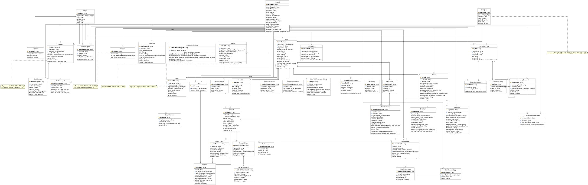

<div align="center">

<!-- (로고 이미지 필요 — 예: assets/logo.png) -->


# 이음 (Eeum)

**지역 소상공인과 소비자를 잇는 플랫폼**

[](https://spring.io/projects/spring-boot)
[](https://openjdk.org/projects/jdk/17/)
[](https://www.mysql.com/)
[](https://redis.io/)
[](https://expo.dev/)
[](https://vitejs.dev/)

</div>

---

## 📖 프로젝트 소개

**이음**은 지역 소상공인과 소비자를 연결하는 O2O(Online to Offline) 플랫폼입니다.  
소비자는 주변 가게를 탐색하고 상품을 주문·예약하며, 소상공인은 가게를 관리하고 고객과 소통할 수 있습니다.  
중고거래·커뮤니티·채팅 기능으로 지역 기반 연결망을 형성합니다.

<!-- (서비스 메인 화면 이미지 필요 — 예: 앱 스크린샷 3~4장 가로 나열) -->
<div align="center">
  
  
  
  
</div>

---

## ✨ 주요 기능

| 기능               | 설명                                          |
| ------------------ | --------------------------------------------- |
| 🏪 **스토어**      | 가게 등록·관리, 영업시간 설정, 공지사항, 리뷰 |
| 🛒 **주문·결제**   | 장바구니, 주문, PortOne 결제 연동             |
| 📅 **방문 예약**   | 시간 슬롯별 예약, 최대 인원 제어              |
| ⚡ **이벤트 상품** | 플래시 세일 이벤트 상품                       |
| 💬 **채팅**        | 1:1 · 그룹 채팅 (WebSocket STOMP)             |
| 🔔 **알림**        | FCM 푸시 + SSE 실시간 알림                    |
| 🏘️ **커뮤니티**    | 게시글, 댓글, 대댓글, 좋아요                  |
| ❤️ **찜**          | 스토어·중고상품 찜                            |
| 📩 **문의**        | 1:1 문의 및 답변                              |
| 🚨 **신고**        | 콘텐츠 신고 및 관리자 처리                    |
| 🗺️ **활동 지역**   | GPS 기반 활동 지역 설정                       |

---

## 🏗️ 시스템 아키텍처

<!-- (아키텍처 다이어그램 이미지 필요 — 전체 시스템 구성도) -->
<div align="center">
  
</div>

### 레이어 구조

```
com.eeum.eeum
├── api/              ← Controllers (REST 엔드포인트)
├── application/      ← Services, DTOs, Mappers, Schedulers
├── domain/           ← JPA Entities, Repositories, Enums, Domain Events
├── infrastructure/   ← 외부 연동 어댑터 (FCM, SSE)
├── config/           ← Spring 설정 빈
├── security/         ← JWT 필터 체인, UserDetails
├── common/           ← BaseEntity, RedisUtil, RedisLockService, SecurityUtil
└── exception/        ← ErrorCode, 예외 클래스, GlobalExceptionHandler
```

---

## 🛠️ 기술 스택

### Backend

| 분류           | 기술                                |
| -------------- | ----------------------------------- |
| Language       | Java 17                             |
| Framework      | Spring Boot 4.0.6                   |
| ORM            | Spring Data JPA + QueryDSL 5.1      |
| Security       | Spring Security + JWT (jjwt 0.12.6) |
| Real-time      | WebSocket (STOMP)                   |
| Cache / Lock   | Redis 7                             |
| Database       | MySQL 8.0                           |
| Push           | Firebase Cloud Messaging (FCM)      |
| Payment        | PortOne                             |
| Object Storage | AWS S3                              |
| OAuth          | Kakao OAuth 2.0                     |
| API Docs       | SpringDoc OpenAPI 3.0               |
| Build          | Gradle                              |

### Frontend

| 분류      | 기술                |
| --------- | ------------------- |
| 모바일 앱 | React Native (Expo) |
| 관리자 웹 | React + Vite        |

### Infrastructure

| 분류      | 기술                    |
| --------- | ----------------------- |
| Container | Docker / Docker Compose |
| CI/CD     | GitHub Actions          |

---

## 📁 프로젝트 구조

```
eeum/
├── backend/            ← Spring Boot API 서버
├── frontend-app/       ← React Native (Expo) 모바일 앱
├── frontend-web/       ← React 관리자 웹
├── docs/               ← 설계 문서 (SDD 등)
├── docker-compose.yml  ← 로컬 인프라 (MySQL, Redis)
└── .env.example        ← 환경 변수 예시
```

---

## 🚀 시작하기

### 사전 요구사항

- Java 17+
- Docker & Docker Compose
- Node.js 18+

### 1. 저장소 클론

```bash
git clone https://github.com/your-org/eeum.git
cd eeum
```

### 2. 환경 변수 설정

```bash
cp .env.example .env
# .env 파일을 열어 필수 값 입력
```

<details>
<summary>필수 환경 변수 목록</summary>

| 변수                                                  | 설명                   |
| ----------------------------------------------------- | ---------------------- |
| `JWT_SECRET`                                          | HS256 서명 키          |
| `DB_URL` / `DB_USERNAME` / `DB_PASSWORD`              | MySQL 접속 정보        |
| `REDIS_HOST` / `REDIS_PORT`                           | Redis 접속 정보        |
| `MAIL_USERNAME` / `MAIL_PASSWORD`                     | Gmail SMTP             |
| `AWS_ACCESS_KEY` / `AWS_SECRET_KEY` / `AWS_S3_BUCKET` | AWS S3                 |
| `PORTONE_API_SECRET` / `PORTONE_WEBHOOK_SECRET`       | PortOne 결제           |
| `KAKAO_REST_API_KEY`                                  | 카카오 OAuth           |
| `FCM_PROJECT_ID` / `FCM_SERVICE_ACCOUNT_KEY_PATH`     | Firebase FCM           |
| `NTS_BUSINESS_SERVICE_KEY`                            | 국세청 사업자 조회 API |

</details>

### 3. 로컬 인프라 실행 (MySQL + Redis)

```bash
docker-compose up -d
```

### 4. 백엔드 실행

```bash
cd backend
./gradlew bootRun
```

Swagger UI: [http://localhost:8080/swagger-ui/index.html](http://localhost:8080/swagger-ui/index.html)

### 5. 모바일 앱 실행

```bash
cd frontend-app
npm install
npx expo start
```

### 6. 관리자 웹 실행

```bash
cd frontend-web
npm install
npm run dev
```

---

## 🗄️ ERD

<!-- (ERD 이미지 필요 — DB 설계 다이어그램) -->
<div align="center">
  
</div>

---

## 📡 API 명세

서버 실행 후 Swagger UI에서 전체 API를 확인할 수 있습니다.

```
http://localhost:8080/swagger-ui/index.html
```

주요 API 그룹:

| 태그         | 경로                    | 설명                          |
| ------------ | ----------------------- | ----------------------------- |
| Auth         | `/auth/**`              | 로그인, 회원가입, 토큰 재발급 |
| Account      | `/accounts/**`          | 회원 정보 관리                |
| Store        | `/stores/**`            | 스토어 CRUD                   |
| Order        | `/orders/**`            | 주문·장바구니                 |
| Reservation  | `/reservations/**`      | 방문 예약                     |
| Chat         | `/chat-rooms/**`, `/ws` | 채팅 REST + WebSocket         |
| Community    | `/community/**`         | 커뮤니티 게시판               |
| Notification | `/notifications/**`     | 알림                          |
| Report       | `/reports/**`           | 신고                          |
| Admin        | `/admin/**`             | 관리자 전용 API               |

---

## 🔑 핵심 설계 패턴

### 동시성 제어

주문 생성, 재고 차감, 예약 처리는 Redis 분산 락으로 동시성을 보장합니다.

```java
redisLockService.executeWithLock(LockKeys.ORDER + orderId, () -> { ... });
```

### 도메인 이벤트

FCM 푸시·SSE 알림은 도메인 이벤트를 통해 트랜잭션과 분리됩니다.

```java
eventPublisher.publishEvent(new OrderPaidEvent(order));
// @TransactionalEventListener(AFTER_COMMIT) + @Async
```

### 멱등성 보장

- PortOne Webhook: Redis + DB Unique 제약으로 중복 결제 처리 방지
- ChatRoom 생성: 동일 참여자 조합의 중복 방 생성 방지

---

## 🧪 테스트

```bash
cd backend

# 전체 테스트 실행
./gradlew test

# 단일 클래스 테스트
./gradlew test --tests "com.eeum.eeum.ClassName"

# 클린 빌드
./gradlew clean build
```

---

## 👥 팀원

| 이름   | 역할          |
| ------ | ------------- |
| 정승민 | 팀장 · 백엔드 |
| 김재현 | 프론트엔드    |
| 최정원 | 프론트엔드    |

---

## 📄 라이선스

이 프로젝트는 팀 내부 프로젝트입니다.
